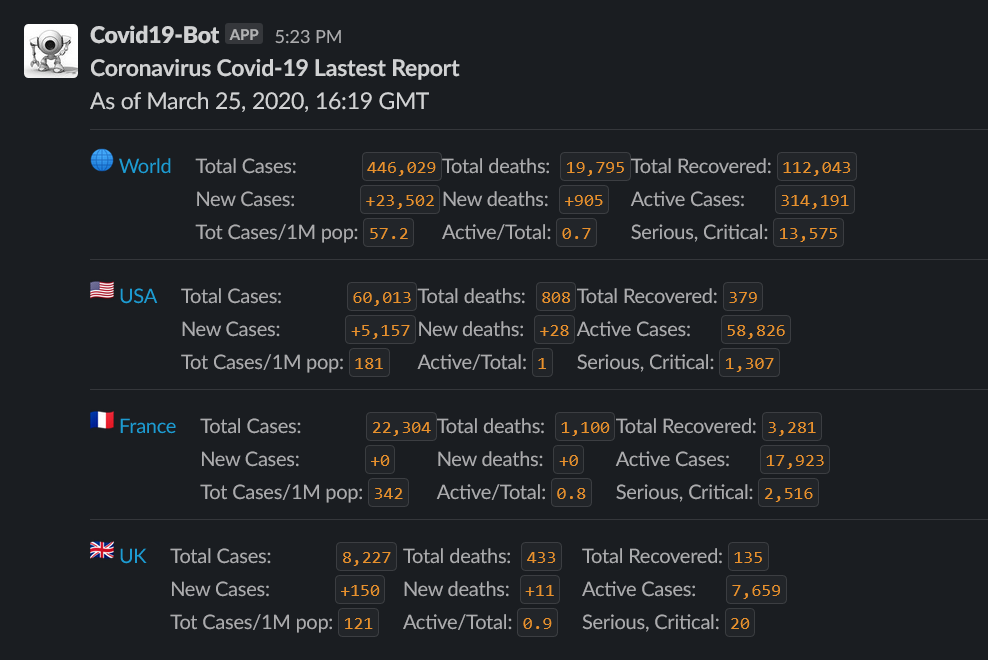

# Covid-19 Bot

A bot that post updates about Covid-19 pandemic to a Slack channel.

> Information source: https://www.worldometers.info/coronavirus/

## Requirements

Minimal requirement is just `docker` or `Python3.8`

You will also need a [`Slack` webhook url](https://api.slack.com/messaging/webhooks).

## Usage

The application uses `docker` for easier deployment. You can use the
`Makefile` commands to do all the tasks.

To run the application:

    export SLACK_WEBHOOK="https://hooks.slack.com/services/xxxxxx"
    export CHANNEL="#xxxxxx" # optional
    make build
    make run
    
### Add/Remove countries

Edit the `config.json` file.

Key is the anchor from the worldometers's table, value is how to display in slack.

## Contribute

You can install the environment, or use the `docker` environment.

### With `docker`:

    make init
    
### With local environment:

Install a `Python3.8` environment, and optionally create a `virtualenv`.

    make install
    
To run locally:

    export SLACK_WEBHOOK="https://hooks.slack.com/services/xxxxxx"
    export CHANNEL="#xxxxxx" # optional
    python3.8 app.py

### Testing

You can run the various checks with:

    make precommit
    
Or individual check (see list in `Makefile`):

    make check.lint
